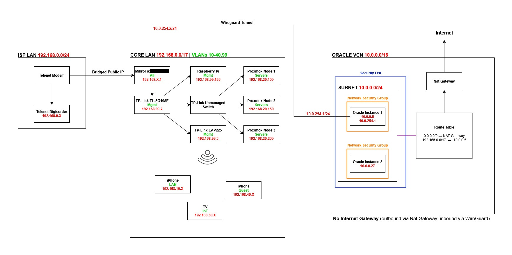

# Homelab 2.0

Demonstrating **enterprise-grade network security** and **infrastructure management**.

## Architecture Overview

**Homelab 2.0** consisting of:
- **MikroTik Router** - Router with VLAN segmentation and WireGuard VPN
- **TP-Link Managed Switch** - Managed switch for VLAN support
- **TP-Link Access Point** - Access point with VLAN tagging
- **Raspberry Pi** - Monitoring + DNS + Reverse Proxy (AdGuard Home + Uptime Kuma + Caddy)
- **Proxmox Cluster** - 3-node cluster running high availability workloads with Terraform IaC
- **Oracle CloudLab** - VCN with 2 instances (one acting as WireGuard client to seamlessly connect to homelab)
- **Storage & Backup** - SMB-based NAS + SFTP backup service

### Network Diagram

### Public Stats
[Grafana](https://coventix.be/grafana)

## Included

### Network Infrastructure
- **VLAN Segmentation**: Separate networks for LAN, servers, IoT, guests, and management
- **WireGuard VPN**: Secure remote access with key-based authentication
- **Firewall Configuration**: Comprehensive security rules with logging
- **mDNS Bridging**: Enables casting between VLANs for IoT devices
- **Oracle VCN Integration**: Extends the homelab network into Oracle Cloud with WireGuard for seamless hybrid connectivity

### Services & Monitoring
- **AdGuard Home**: DNS ad-blocking and filtering
- **Uptime Kuma**: Service monitoring and uptime tracking
- **Caddy**: Reverse proxy for internal services
- **Proxmox**: Infrastructure as Code with Terraform for self-hosted applications
- **Proxmox Cluster HA Web Service**:
  - 2 **Nginx containers** running on different Proxmox nodes  
  - 1 **Load balancer container** on a third node for redundancy and distribution (HaProxy)  
- **Code-server**: Web-based IDE with SSHFS-mounted home directories across all devices for seamless configuration management
- **SMB "NAS"**: Shared file storage across the homelab
- **SFTP Router Backup**: Automated backup service for router configs

### Security Features
- **Guest Network Isolation**: Complete separation from internal resources
- **Management Network**: Dedicated VLAN for administrative access
- **Comprehensive Logging**: Security event monitoring and alerting
- **Default Deny Firewall**: Secure by default configuration
- **Hybrid Security**: Oracle Cloud instances secured with WireGuard, Security Lists and Network Security Groups (Inbound access via WireGuard; Outbound via NAT Gateway)
